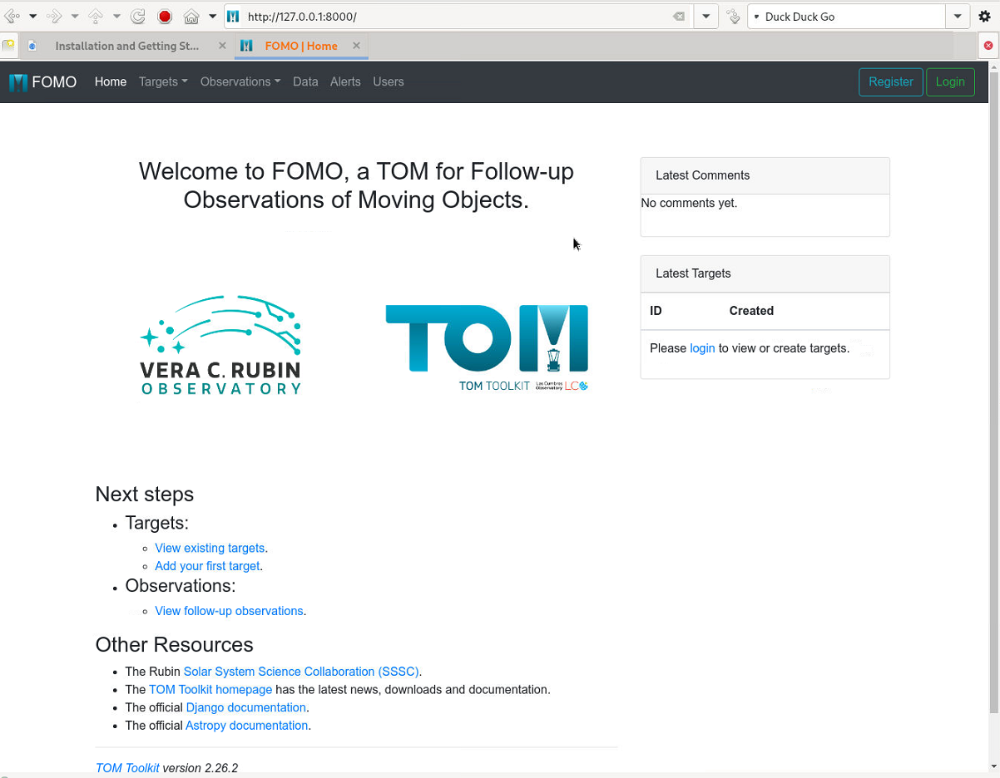

.. _installation:

Installation and Getting Started
====================================

.. note::
   ``fomo`` is both pip both and conda/mamba installable (but the latter is
   less used/tested by the developers). We strongly recommend installing into a virtual environment in either case.

Requirements
-----------------------------

``fomo`` has the following requirements that will be automatically installed  using pip or conda when you install the requirements from the ``pytproject.toml`` file in the fomo package:

* python 3.9 or later
* astropy
* tomtoolkit>=2.26.2
* tom_alertstreams
* tom_fink
* tom-registration
* numpy>=2.0
* sorcha (which has several other dependencies of which the ones below are likely to be the largest or most troublesome):

  * assist
  * numba
  * pandas
  * rebound
  * scipy
  * spiceypy

Setting Up Your Virtual Environment
---------------------------------------

Before installing any dependencies or writing code, it's a great idea to create a virtual environment. The FOMO and TOM Toolkit developers primarily use the `venv` module and `pip` to create and manage virtual environments respectively.

.. note::
   Windows users will need to do this setup in a WSL2 Linux instance. Although the TOM Toolkit and FOMO works fine in Python under native Windows, the `assist` and `healpy` libraries needed by `sorcha` won't build under Windows.

.. code-block:: console

   >> python3 -m venv ~/path-to-new-venv
   >> source ~/path-to-new-venv/bin/activate

Alternatively, the LINCC-Frameworks engineers primarily use `conda` to manage virtual environments. If you have conda installed locally, you can run the following create and activate a new environment.

.. code-block:: console

   >> conda create env -n <env_name> python=3.10
   >> conda activate <env_name>

Once you have created a new environment, you can install this project for local
development using the following commands:

.. code-block:: console

   >> pip install -e .'[dev]'
   >> pre-commit install
   >> pip (or conda) install pandoc

Notes:

1) The single quotes around ``'[dev]'`` may not be required on your operating system.
2) ``pre-commit install`` will initialize pre-commit for this local repository, so
   that a set of tests will be run prior to completing a local commit. For more
   information, see the Python Project Template documentation on
   `pre-commit <https://lincc-ppt.readthedocs.io/en/latest/practices/precommit.html>`_.
3) Installing ``pandoc`` allows you to verify that automatic rendering of Jupyter notebooks
   into documentation for ReadTheDocs works as expected. For more information, see
   the Python Project Template documentation on
   `Sphinx and Python Notebooks <https://lincc-ppt.readthedocs.io/en/latest/practices/sphinx.html#python-notebooks>`_.

Initializing FOMO and the database
-------------------------------------

Once the software and dependencies are installed, there are two setup commands that are needed the first time to create the database and an admin user

.. code-block:: console

   >> python3 manage.py migrate
   >> python3 manage.py createsuperuser

The first command will create the database (by default `src/fomo_db.sqlite3` using the sqlite3 backend, which is perfectly fine for local development. Any of the databases `supported by Django <https://docs.djangoproject.com/en/4.2/topics/install/#database-installation>`_ can also be used).
The second command creates an admin user for FOMO; this can be anything for local development (and the email address is not used). You can ignore any warnings that look like::

   User <foo> is not logged in. Cannot re-encrypt sensitive data. Clearing all encrypted fields instead.

Starting up the webserver
--------------------------------

With that done, you can fire up the lightweight web server built into Django:

.. code-block:: console

   >> python3 manage.py runserver

Several lines of debugging output should appear. You should then be able to point a web browser at http://127.0.0.1:8000/ and see the FOMO front page:

Log in as the admin user you created earlier using the `Login` button in the top right corner of the menu bar.

You can import new Targets into FOMO by clicking on Targets->Targets in the menu bar. This will bring you to the Target overview page (which is blank at the minute). Click Create Targets->Catalog Search and select the desired service from the options. Solar System targets can be imported from:

* JPL
* MPC (using the old `db_search` functionality)
* MPC Explorer (new API; doesn't support comets at present)

In addition sidereal targets can be imported from Simbad and TNS.
FOMO will then fetch the details from the selected service and display the details for review and user modification (if desired). Otherwise you can hit the `Submit` button to create the Target. You will then be redirected to the Target detail page.
